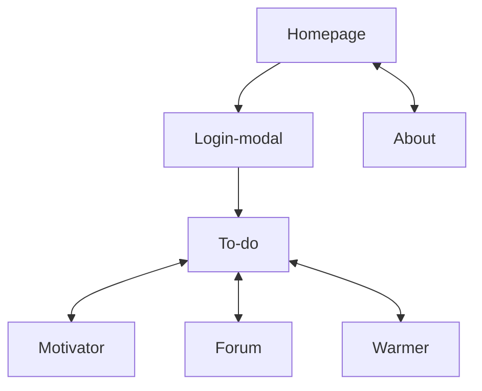

# MoreMoreMe - Portfolio website

Hi! I'm Jose, and this is the project folder of [my portfolio website](https://moremore.me/). If you have any general questions about the project or me, you may find the answers in the about section of the website. Here, we will focus on examining the architecture of this one and the purpose of its pages. But first:

## How to open the project on your computer:

1. Install Node.js: download and install Node.js from the [official website](https://nodejs.org) following the installation instructions for your operating system.

2. Clone the repository: navigate to the directory where you want to clone the repository and run the following command in your terminal:

```
git clone git@github.com:thelittlemitak/portfolio.git
```

3. Install dependencies by running the following command in your terminal:
```
npm install
```

4. Start the development server: once the folder is downloaded, you can run the following command in order to run the React project locally (it should appear on  http://localhost:3000):

```
npm start
```

## Flowchart



<br>
Since this is a portfolio, my main goal was putting into practice as many tools as possible under one large project. Every page of the website has a different purpose:

<br>

## Homepage

On the homepage, I aimed to incorporate the most common web components to maximize my CSS practice. I included elements such as a carousel, cards, tables, testimonials and various lists. Additionally, I followed design rules and best practices, including considerations for contrast, white spaces, and color choices. I want to highlight that the graphic on the left side of the hero section was created by me using Affinity Designer.

Please note that while I mentioned certain features in the introduction, you may not find all of them implemented in the subsequent pages. My main focus was to create a realistic-looking homepage, so I included more tools than what is actually present. The intention was to showcase my design and development skills by creating a comprehensive and visually appealing homepage.

## About

On this page, you will also find various common components. However, the main purpose of this page is to provide explanations about the website itself and to provide a brief overview of myself. It serves as an introduction to provide visitors with information about the purpose and content of the website, as well as to offer some insights into my background and experience.

## To-do/Motivator/Forum/Warmer

In these tools, I focused on implementing the majority of the website's functionality, primarily through modifiable tables. I believe that handling state, side effects, and data transfer between components, particularly in CRUD (Create, Read, Update, Delete) elements such as the modifiable tables, forms the core of working with React. These tools allowed me to practice and demonstrate my ability to effectively manage data and interactivity within a React application.

## Responsiveness

The website has been designed to be responsive across various screen sizes, ranging from 1080p resolution to small mobile phones. To ensure optimal results on different devices, I utilized resources like https://caniuse.com/ and sought feedback from friends and family, particularly regarding various phone operating systems. Even though this website represents a fictional company, I wanted to simulate and address potential bugs and errors that can occur across different operating systems. By doing so, I aimed to gain experience in handling a wide range of issues and provide the best possible user experience on all devices.

<br>

Thank you for taking the time to review my project!
I appreciate your interest and hope you found it informative.

Best regards,

<br>

Jose
