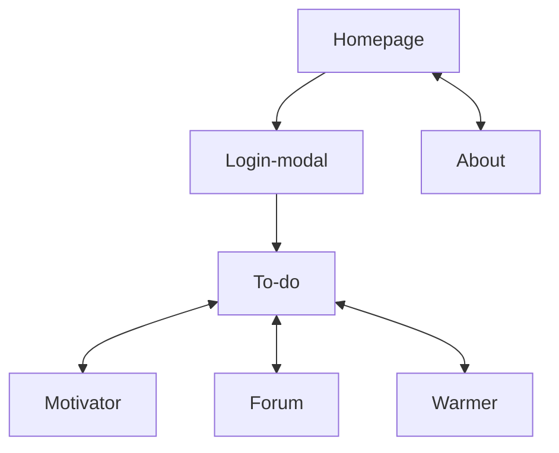

# MoreMoreMe - Portfolio website

Hi! My name is Jose and this is the project folder of [my portfolio website](https://moremore.me/). Most of the general questions that you may have about the project or me are already answered in the about section, so here we will have a look at its architecture and the purpose of its pages.

## Flowchart

 
Since this is a portfolio, my main goal was putting in practice as much tools as possible under one big project. Every page of the website had a different purpose: 

 

## Homepage

On the homepage I tried to make use of the most common web components in order to practice as much CSS as possible such as a carousel, cards, tables, testimonials and different lists. Also design rules and best practices (contrast, white spaces, color choices, etc.). Also the picture of the graphics on the left side of the hero was self-made using Affinity Designer.

Disclaimer: you will see that some of the features announced are not found later on the tools. This is because my priority was to have a complete homepage, no matter how many tools would I later create.

## About

Here you will also find different common components, but the main purpose of this page, is giving some explanations of the website itself and also, a little bit about myself.

## To-do/Motivator/Forum/Warmer

In these tools is where I applied most of the functionality of the website, those being, mostly, modifiable tables. I think that managing state, side effects and data transfer between components, specially on CRUD elements (so in this case, the modifiable tables), are the core of working with React.

## Responsiveness

The website is responsive to different screens, from 1080p to small mobile phones. I also made use of https://caniuse.com/ and feedback from friends and family (specially for the different phone OS) to get the best results on all possible devices. Even if this is not a real company, I still wanted to be presented with the bugs and errors that different OS can have and get to experience as much of them as possible.

 

Thanks for checking!

Jose